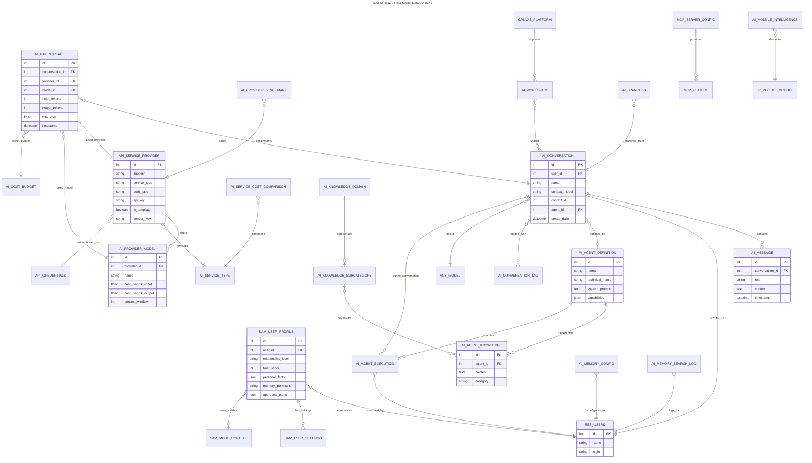
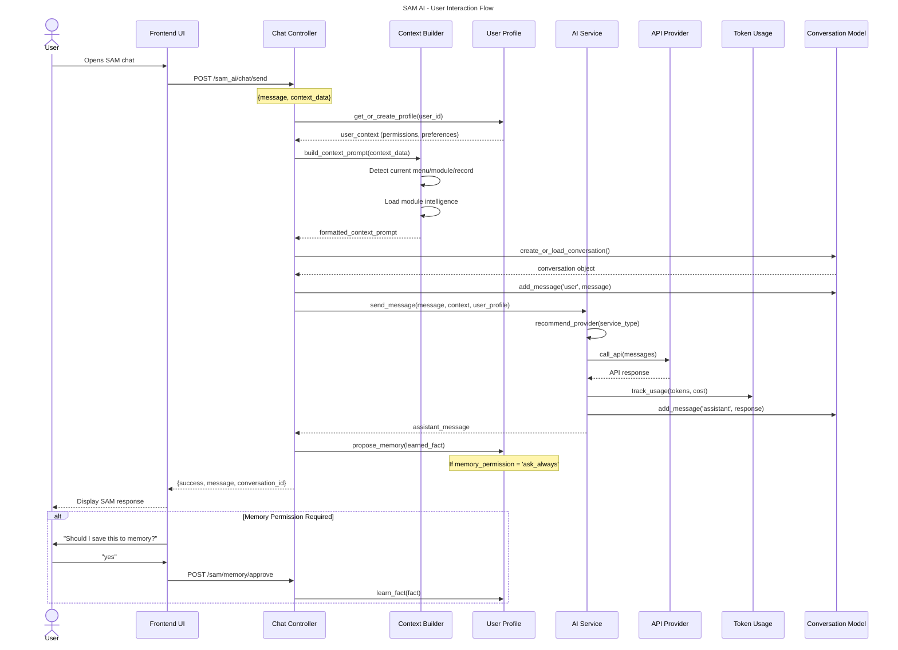
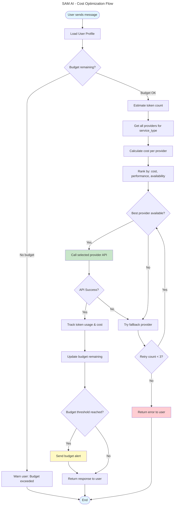
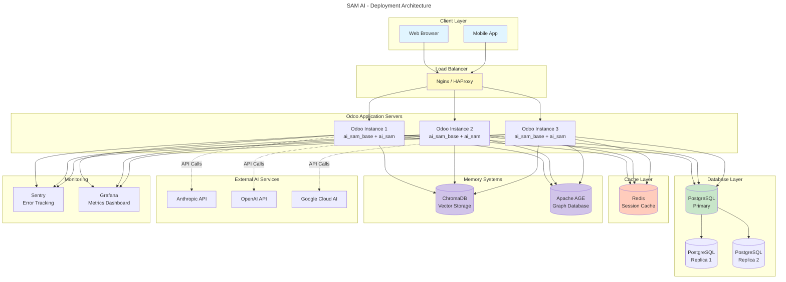

```mermaid
```mermaid
---
title: SAM AI Base - System Architecture
---

graph TB
    subgraph "Frontend Layer (ai_sam module)"
        UI[JavaScript UI]
        WebSocket[WebSocket/SSE]
    end

    subgraph "Controller Layer (HTTP Endpoints)"
        ChatCtrl[sam_ai_chat_controller<br/>18 routes]
        CanvasCtrl[canvas_controller<br/>15 routes]
        MenuCtrl[menu_context_controller<br/>7 routes]
        SessionCtrl[sam_session_controller<br/>12 routes]
        OAuthCtrl[api_oauth_controller<br/>3 routes]
        DevCtrl[sam_developer_mode<br/>7 routes]
        VendorCtrl[vendor_registry_controller<br/>2 routes]
        ServiceCtrl[service_populator_controller<br/>1 route]
        MCPCtrl[mcp_download_controller<br/>3 routes]
        MemoryCtrl[memory_graph_controller<br/>9 routes]
    end

    subgraph "Business Logic Layer (Abstract Models)"
        AIService[ai.service<br/>API Integration]
        ContextBuilder[ai.context.builder<br/>The All-Knowing Brain]
        ContextAnalyzer[ai.context.analyzer<br/>Context Shift Detection]
        CostOptimizer[ai.cost.optimizer<br/>Provider Selection]
        VectorService[ai.vector.service<br/>ChromaDB]
        GraphService[ai.graph.service<br/>Apache AGE]
        MCPGenerator[mcp.server.generator<br/>MCP Server Generator]
    end

    subgraph "Data Layer - Conversation Management"
        Conversation[ai.conversation<br/>Conversation Threads]
        Message[ai.message<br/>Individual Messages]
        ConvTag[ai.conversation.tag<br/>Tags]
        ConvImport[ai.conversation.import<br/>Import Functionality]
    end

    subgraph "Data Layer - API Orchestration"
        Provider[api.service.provider<br/>Multi-API Orchestration]
        ProviderModel[ai.provider.model<br/>AI Models GPT-4, Claude]
        ServiceType[ai.service.type<br/>Service Types]
        Credentials[api.credentials<br/>API Keys OAuth Tokens]
    end

    subgraph "Data Layer - User Personalization"
        UserProfile[sam.user.profile<br/>User Relationship Data]
        UserSettings[sam.user.settings<br/>User Settings]
        SamBehavior[sam.behavior<br/>SAM Personality]
        ModeContext[sam.mode.context<br/>Mode-Specific Context]
        SamEnv[sam.environment<br/>Environment Detection]
    end

    subgraph "Data Layer - Cost Intelligence"
        TokenUsage[ai.token.usage<br/>Token Tracking]
        CostBudget[ai.cost.budget<br/>Budget Management]
        Benchmark[ai.provider.benchmark<br/>Performance Tracking]
        CostComparison[ai.service.cost.comparison<br/>Cost Dashboard]
    end

    subgraph "Data Layer - Agent Ecosystem"
        AgentDef[ai.agent.definition<br/>Agent Registry]
        AgentKnowledge[ai.agent.knowledge<br/>Training Data]
        AgentExec[ai.agent.execution<br/>Audit Trail]
        KnowledgeDomain[ai.knowledge.domain<br/>Knowledge Domains]
        KnowledgeSub[ai.knowledge.subcategory<br/>Subcategories]
    end

    subgraph "Data Layer - Memory System"
        MemoryConfig[ai.memory.config<br/>Memory Configuration]
        MemoryLog[ai.memory.search.log<br/>Search Logging]
    end

    subgraph "Data Layer - Canvas Platform"
        CanvasPlatform[canvas.platform<br/>Platform Config]
        Branches[ai.branches<br/>Conversation Branching]
        Workspace[ai.workspace<br/>Team Workspaces]
    end

    subgraph "Data Layer - Module Intelligence"
        ModuleIntel[ai.module.intelligence<br/>Module Training Data]
        DocumentExtractor[ai.document.extractor<br/>Document Extraction]
    end

    subgraph "Data Layer - MCP Server"
        MCPConfig[mcp.server.config<br/>MCP Server Config]
        MCPFeature[mcp.feature<br/>MCP Features]
    end

    subgraph "External Services"
        Anthropic[Anthropic Claude API]
        OpenAI[OpenAI API]
        Google[Google Cloud AI]
        Azure[Microsoft Azure AI]
        ChromaDB[(ChromaDB<br/>Vector Storage)]
        ApacheAGE[(Apache AGE<br/>Graph Database)]
    end

    %% Frontend connections
    UI --> ChatCtrl
    UI --> CanvasCtrl
    UI --> MenuCtrl
    UI --> SessionCtrl
    UI --> DevCtrl
    WebSocket --> ChatCtrl

    %% Controller to Business Logic
    ChatCtrl --> AIService
    ChatCtrl --> ContextBuilder
    ChatCtrl --> CostOptimizer

    CanvasCtrl --> ContextBuilder
    MenuCtrl --> ContextBuilder
    MenuCtrl --> ModuleIntel

    SessionCtrl --> UserProfile
    OAuthCtrl --> Credentials

    DevCtrl --> UserProfile
    MemoryCtrl --> VectorService
    MemoryCtrl --> GraphService

    %% Business Logic to Data
    AIService --> Provider
    AIService --> TokenUsage

    ContextBuilder --> ModuleIntel
    ContextBuilder --> Conversation
    ContextBuilder --> UserProfile

    CostOptimizer --> Provider
    CostOptimizer --> ProviderModel
    CostOptimizer --> Benchmark

    VectorService --> MemoryConfig
    VectorService --> MemoryLog

    GraphService --> MemoryConfig

    %% Data Layer Relationships
    Conversation --> Message
    Conversation --> UserProfile
    Conversation --> ConvTag
    Conversation --> AgentDef

    Provider --> ProviderModel
    Provider --> ServiceType
    Provider --> Credentials

    UserProfile --> UserSettings
    UserProfile --> ModeContext

    TokenUsage --> Provider
    TokenUsage --> ProviderModel
    TokenUsage --> Conversation
    TokenUsage --> CostBudget

    AgentDef --> AgentKnowledge
    AgentDef --> AgentExec

    KnowledgeDomain --> KnowledgeSub

    CanvasPlatform --> Workspace
    CanvasPlatform --> Branches

    MCPConfig --> MCPFeature
    MCPGenerator --> MCPConfig

    %% External Service Connections
    AIService -.->|API Calls| Anthropic
    AIService -.->|API Calls| OpenAI
    AIService -.->|API Calls| Google
    AIService -.->|API Calls| Azure

    VectorService -.->|Vector Operations| ChromaDB
    GraphService -.->|Graph Queries| ApacheAGE

    %% Styling
    classDef frontend fill:#e1f5ff,stroke:#01579b,stroke-width:2px
    classDef controller fill:#fff9c4,stroke:#f57f17,stroke-width:2px
    classDef logic fill:#f3e5f5,stroke:#4a148c,stroke-width:2px
    classDef data fill:#e8f5e9,stroke:#1b5e20,stroke-width:2px
    classDef external fill:#ffebee,stroke:#b71c1c,stroke-width:2px,stroke-dasharray: 5 5

    class UI,WebSocket frontend
    class ChatCtrl,CanvasCtrl,MenuCtrl,SessionCtrl,OAuthCtrl,DevCtrl,VendorCtrl,ServiceCtrl,MCPCtrl,MemoryCtrl controller
    class AIService,ContextBuilder,ContextAnalyzer,CostOptimizer,VectorService,GraphService,MCPGenerator logic
    class Conversation,Message,ConvTag,ConvImport,Provider,ProviderModel,ServiceType,Credentials,UserProfile,UserSettings,SamBehavior,ModeContext,SamEnv,TokenUsage,CostBudget,Benchmark,CostComparison,AgentDef,AgentKnowledge,AgentExec,KnowledgeDomain,KnowledgeSub,MemoryConfig,MemoryLog,CanvasPlatform,Branches,Workspace,ModuleIntel,DocumentExtractor,MCPConfig,MCPFeature data
    class Anthropic,OpenAI,Google,Azure,ChromaDB,ApacheAGE external
```

# Architecture

**Original file:** `ARCHITECTURE.mermaid`
**Type:** MERMAID

---



---

## Model Relationship Diagram



---

## User Interaction Flow



---

## Cost Optimization Flow



---

## Memory Permission Flow

```mermaid
---
title: SAM AI - Memory Permission Flow
---

stateDiagram-v2
    [*] --> NewUser: User first login

    NewUser --> AskAlways: Default permission level

    state AskAlways {
        [*] --> DetectFact: SAM learns something
        DetectFact --> AskUser: Propose memory
        AskUser --> UserResponds: Wait for response

        UserResponds --> SaveFact: User says "yes"
        UserResponds --> DiscardFact: User says "no"
        UserResponds --> UpgradeToAutoWork: User says "always" (work facts)

        SaveFact --> [*]
        DiscardFact --> [*]
    }

    AskAlways --> AutoWork: User chooses "auto-save work info"

    state AutoWork {
        [*] --> CategorizeNew: SAM learns something
        CategorizeNew --> IsWorkFact{Work/technical fact?}

        IsWorkFact --> AutoSaveWork: Yes (auto-save)
        IsWorkFact --> AskPersonal: No (ask permission)

        AskPersonal --> UserRespondsPersonal: Wait for response
        UserRespondsPersonal --> SavePersonal: User says "yes"
        UserRespondsPersonal --> DiscardPersonal: User says "no"
        UserRespondsPersonal --> UpgradeToAutoAll: User says "always"

        AutoSaveWork --> [*]
        SavePersonal --> [*]
        DiscardPersonal --> [*]
    }

    AutoWork --> AutoAll: User chooses "auto-save everything"

    state AutoAll {
        [*] --> AutoSaveAll: SAM learns anything
        AutoSaveAll --> [*]: Save immediately
    }

    AutoAll --> AskAlways: User revokes trust
    AutoWork --> AskAlways: User revokes trust

    style NewUser fill:#e1f5ff
    style AskAlways fill:#fff9c4
    style AutoWork fill:#c8e6c9
    style AutoAll fill:#b2dfdb
```

---

## Deployment Architecture



---

**Note:** These diagrams are written in Mermaid syntax and can be rendered in:
- GitHub (automatic rendering in .md files)
- GitLab (automatic rendering)
- VS Code (with Mermaid Preview extension)
- Online: https://mermaid.live

**Last Updated:** December 10, 2025

```
