# SAM AI Database Schema (ERD)

**Auto-generated** on module upgrade.

- **Models:** 46
- **Relationships:** 144

## Interactive View

For zoom/pan capability, visit: `/sam_insights/erd`

## Entity Relationship Diagram

```mermaid
erDiagram
    ai_conversation }o--|| calendar_event : "activity_calendar_event_id"
    ai_conversation ||--o{ mail_activity : "activity_ids"
    ai_conversation }o--|| res_users : "activity_user_id"
    ai_conversation }o--|| ai_agent_registry : "agent_id"
    ai_conversation ||--o{ ai_message : "ai_message_ids"
    ai_conversation }o--|| api_service_provider : "ai_provider_id"
    ai_conversation ||--o{ ai_conversation : "child_session_ids"
    ai_conversation }o--|| res_company : "company_id"
    ai_conversation }o--|| res_users : "create_uid"
    ai_conversation ||--o{ mail_followers : "message_follower_ids"
    ai_conversation ||--o{ mail_message : "message_ids"
    ai_conversation }o--o{ res_partner : "message_partner_ids"
    ai_conversation }o--|| ai_conversation : "parent_session_id"
    ai_conversation ||--o{ rating_rating : "rating_ids"
    ai_conversation }o--o{ ai_knowledge_subcategory : "subcategory_ids"
    ai_conversation }o--o{ ai_conversation_tag : "tag_ids"
    ai_conversation }o--|| res_users : "user_id"
    ai_conversation ||--o{ mail_message : "website_message_ids"
    ai_conversation }o--o{ ai_workspace : "workspace_ids"
    ai_conversation }o--|| res_users : "write_uid"
    ai_access_gate }o--|| ai_conversation : "conversation_id"
    ai_access_gate }o--|| res_users : "create_uid"
    ai_access_gate }o--|| res_users : "user_id"
    ai_access_gate }o--|| res_users : "write_uid"
    ai_agent_execution }o--|| ai_agent_registry : "agent_id"
    ai_agent_execution }o--|| ai_conversation : "conversation_id"
    ai_agent_execution }o--|| res_users : "create_uid"
    ai_agent_execution }o--|| res_users : "user_id"
    ai_agent_execution }o--|| res_users : "write_uid"
    ai_agent_knowledge }o--|| ai_agent_registry : "agent_id"
    ai_agent_knowledge }o--|| res_users : "create_uid"
    ai_agent_knowledge }o--|| res_users : "write_uid"
    ai_agent_registry }o--|| res_users : "create_uid"
    ai_agent_registry ||--o{ ai_agent_knowledge : "knowledge_ids"
    ai_agent_registry }o--|| res_users : "write_uid"
    ai_branch }o--|| res_users : "create_uid"
    ai_branch }o--|| res_users : "write_uid"
    ai_conversation_import }o--|| res_users : "create_uid"
    ai_conversation_import }o--|| res_users : "write_uid"
    ai_cost_budget }o--|| res_company : "company_id"
    ai_cost_budget }o--|| res_users : "create_uid"
    ai_cost_budget }o--|| api_service_provider : "fallback_provider_id"
    ai_cost_budget }o--|| res_users : "user_id"
    ai_cost_budget }o--|| res_users : "write_uid"
    ai_cost_optimizer }o--|| res_users : "create_uid"
    ai_cost_optimizer }o--|| api_service_provider : "recommended_provider_id"
    ai_cost_optimizer }o--|| res_users : "user_id"
    ai_cost_optimizer }o--|| res_users : "write_uid"
    ai_memory_config }o--|| res_users : "create_uid"
    ai_memory_config }o--|| res_users : "write_uid"
    ai_memory_search_log }o--|| ai_conversation : "conversation_id"
    ai_memory_search_log }o--|| res_users : "create_uid"
    ai_memory_search_log }o--|| res_users : "user_id"
    ai_memory_search_log }o--|| res_users : "write_uid"
    ai_message }o--|| ai_conversation : "conversation_id"
    ai_message }o--|| res_users : "create_uid"
    ai_message }o--|| res_users : "write_uid"
    ai_mode_registry }o--|| res_users : "create_uid"
    ai_mode_registry }o--|| res_users : "write_uid"
    ai_provider_model }o--|| res_users : "create_uid"
    ai_provider_model }o--|| api_service_provider : "provider_id"
    ai_provider_model }o--|| res_users : "write_uid"
    ai_module_intelligence }o--|| res_users : "create_uid"
    ai_module_intelligence }o--|| ir_module_module : "module_id"
    ai_module_intelligence }o--|| res_users : "write_uid"
    ai_provider_benchmark }o--|| res_users : "create_uid"
    ai_provider_benchmark }o--|| api_service_provider : "provider_id"
    ai_provider_benchmark }o--|| res_users : "user_id"
    ai_provider_benchmark }o--|| res_users : "write_uid"
    ai_service_cost_comparison }o--|| api_service_provider : "provider_id"
    ai_service_cost_comparison }o--|| ai_service_type : "service_type_id"
    ai_service_type }o--|| res_users : "create_uid"
    ai_service_type }o--o{ api_service_provider : "provider_ids"
    ai_service_type }o--|| res_users : "write_uid"
    ai_token_usage }o--|| res_company : "company_id"
    ai_token_usage }o--|| ai_conversation : "conversation_id"
    ai_token_usage }o--|| res_users : "create_uid"
    ai_token_usage }o--|| _unknown : "invoice_id"
    ai_token_usage }o--|| api_service_provider : "service_provider_id"
    ai_token_usage }o--|| res_users : "user_id"
    ai_token_usage }o--|| res_users : "write_uid"
    ai_workspace }o--o{ ai_conversation : "conversation_ids"
    ai_workspace }o--|| res_users : "create_uid"
    ai_workspace }o--o{ res_users : "member_ids"
    ai_workspace }o--|| res_users : "owner_id"
    ai_workspace }o--|| res_users : "write_uid"
    ai_extractor_plugin }o--|| res_users : "create_uid"
    ai_extractor_plugin }o--|| res_users : "write_uid"
    ai_conversation_tag }o--|| res_users : "create_uid"
    ai_conversation_tag }o--|| res_users : "write_uid"
    ai_knowledge_domain }o--|| res_users : "create_uid"
    ai_knowledge_domain }o--|| res_users : "write_uid"
    ai_knowledge_subcategory }o--o{ ai_conversation : "conversation_ids"
    ai_knowledge_subcategory }o--|| res_users : "create_uid"
    ai_knowledge_subcategory }o--|| ai_knowledge_domain : "domain_id"
    ai_knowledge_subcategory }o--|| res_users : "write_uid"
    sam_mcp_feature }o--|| res_users : "create_uid"
    sam_mcp_feature }o--|| ir_model : "odoo_model"
    sam_mcp_feature }o--|| sam_mcp_server_config : "server_config_id"
    sam_mcp_feature }o--|| res_users : "write_uid"
    sam_mcp_server_config }o--|| res_users : "create_uid"
    sam_mcp_server_config }o--o{ ir_model : "custom_model_ids"
    sam_mcp_server_config ||--o{ sam_mcp_feature : "feature_ids"
    sam_mcp_server_config }o--o{ api_service_provider : "provider_ids"
    sam_mcp_server_config }o--|| res_users : "write_uid"
    sam_mode_context ||--o{ sam_mode_context : "child_ids"
    sam_mode_context }o--|| res_users : "create_uid"
    sam_mode_context }o--|| sam_mode_context : "parent_id"
    sam_mode_context }o--|| res_users : "write_uid"
    sam_environment }o--|| res_users : "create_uid"
    sam_environment }o--|| res_users : "write_uid"
    sam_ai_page }o--|| ai_conversation : "conversation_id"
    sam_ai_page }o--|| res_users : "create_uid"
    sam_ai_page }o--|| res_users : "write_uid"
    sam_page_publisher }o--|| res_users : "create_uid"
    sam_page_publisher }o--|| res_users : "write_uid"
    sam_user_profile }o--|| res_users : "create_uid"
    sam_user_profile }o--|| res_users : "user_id"
    sam_user_profile }o--|| res_users : "write_uid"
    sam_user_settings }o--|| res_users : "create_uid"
    sam_user_settings }o--|| res_users : "user_id"
    sam_user_settings }o--|| res_users : "write_uid"
    sam_field_creator }o--|| res_users : "create_uid"
    sam_field_creator }o--|| ir_model_fields : "field_id"
    sam_field_creator }o--|| ir_model : "model_id"
    sam_field_creator }o--|| ir_model : "relation_model_id"
    sam_field_creator }o--|| res_users : "write_uid"
    sam_upgrade_queue }o--|| res_users : "create_uid"
    sam_upgrade_queue }o--|| ir_module_module : "module_id"
    sam_upgrade_queue }o--|| res_users : "write_uid"
    sam_theme_settings }o--|| res_company : "company_id"
    sam_theme_settings }o--|| res_users : "create_uid"
    sam_theme_settings }o--|| res_users : "write_uid"
    sam_view_customization }o--|| res_users : "create_uid"
    sam_view_customization }o--|| sam_view_customizer : "customizer_id"
    sam_view_customization }o--|| ir_model_fields : "field_id"
    sam_view_customization }o--|| res_users : "write_uid"
    sam_view_customizer }o--|| ir_ui_view : "base_view_id"
    sam_view_customizer }o--|| res_company : "company_id"
    sam_view_customizer }o--|| res_users : "create_uid"
    sam_view_customizer ||--o{ sam_view_customization : "customization_ids"
    sam_view_customizer }o--|| ir_ui_view : "inherited_view_id"
    sam_view_customizer }o--|| ir_model : "model_id"
    sam_view_customizer }o--|| res_users : "write_uid"
    ai_service {
        string name "Primary model"
    }
    ai_context_analyzer {
        string name "Primary model"
    }
    ai_context_builder {
        string name "Primary model"
    }
    ai_graph_service {
        string name "Primary model"
    }
    ai_location_introspector {
        string name "Primary model"
    }
    ai_vector_service {
        string name "Primary model"
    }
    ai_document_extractor {
        string name "Primary model"
    }
    sam_personality {
        string name "Primary model"
    }
    sam_funnel_context {
        string name "Primary model"
    }
```

## Legend

| Symbol | Meaning |
|--------|---------|
| `||--o{` | One-to-Many |
| `}o--||` | Many-to-One |
| `}o--o{` | Many-to-Many |

