# SAM AI - UI Module Architecture Diagrams

## System Architecture Overview

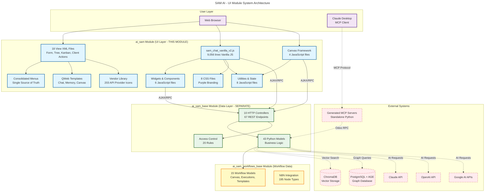

---

## Platform Skin Architecture (Migration 2025-11-30)

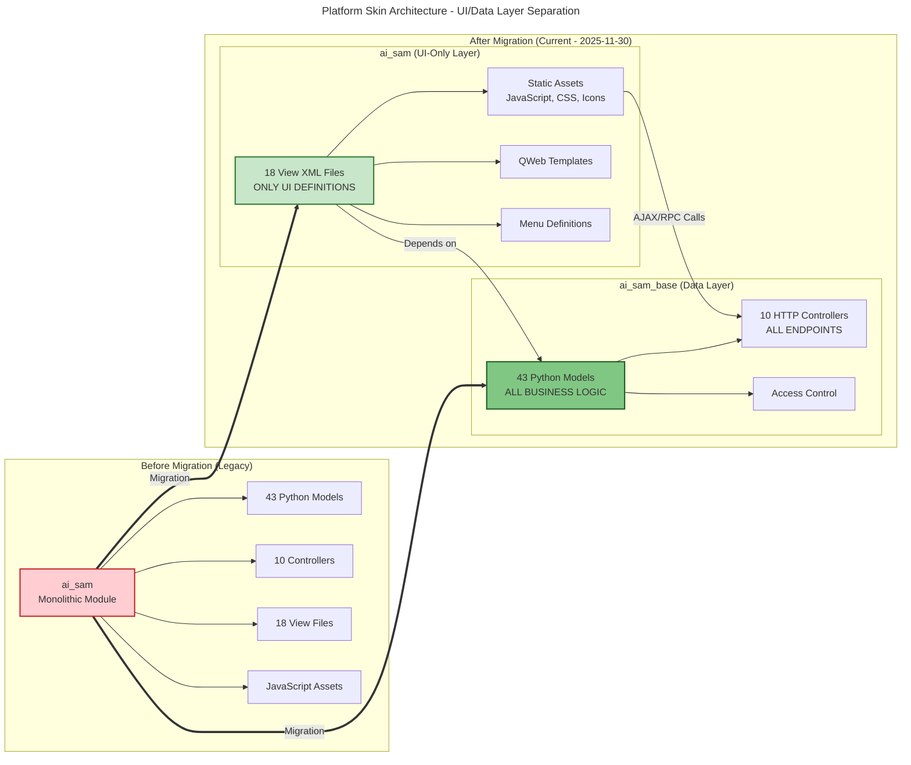

**Benefits:**
- **Separation of Concerns**: UI changes don't require Python restarts
- **Independent Updates**: Update views without affecting business logic
- **Clearer Dependencies**: ai_sam depends on ai_sam_base (unidirectional)
- **Easier Testing**: Test business logic without UI complexity

---

## View Layer Architecture (18 XML Files)

```mermaid
---
title: SAM AI - View Layer Structure
---

graph TB
    Root[sam_ai_menus_consolidated.xml<br/>Root Menu Structure]

    subgraph "Main Views (13 Files)"
        ChatView[sam_ai_chat_v2_action.xml<br/>Client Action - Chat Interface]
        APIProviderView[api_service_provider_views.xml<br/>8-Tab Progressive Disclosure]
        MemoryDashView[ai_memory_dashboard_simple.xml<br/>Client Action - Memory Stats]
        MCPView[mcp_server_config_views.xml<br/>MCP Server Generation]
        PowerPromptsView[sam_mode_context_view.xml<br/>Hierarchical AI Agents]
        CostView[ai_service_cost_comparison_views.xml<br/>Pivot/Graph Cost Analysis]
        WorkspaceView[ai_workspace_views.xml<br/>Team Collaboration]
        ConvReaderView[ai_conversation_reader_views.xml<br/>Conversation Browser]
        ProviderModelView[ai_provider_model_views.xml<br/>AI Model Config]
        ConvView[ai_conversation_views.xml<br/>Conversation Management]
        MessageView[ai_conversation_message_views.xml<br/>Message Display]
        ServiceView[ai_service_views.xml<br/>AI Service Config]
        CredsView[api_credentials_views.xml<br/>Encrypted API Keys]
    end

    subgraph "Memory Views (5 Files)"
        MemoryGraphView[memory_graph_simple.xml<br/>Vis.js Graph Template]
        VectorView[ai_memory_vector_views.xml<br/>ChromaDB Vectors]
        ConnectionView[ai_memory_connection_views.xml<br/>Graph Connections]
        EntityView[ai_memory_entity_views.xml<br/>Graph Entities]
        AccessLogView[ai_memory_access_log_views.xml<br/>Access Auditing]
    end

    Root --> ChatView
    Root --> APIProviderView
    Root --> MemoryDashView
    Root --> MCPView
    Root --> PowerPromptsView
    Root --> CostView
    Root --> WorkspaceView
    Root --> ConvReaderView

    APIProviderView --> CredsView
    ChatView --> ConvView
    ConvView --> MessageView
    ChatView --> ServiceView
    ServiceView --> ProviderModelView

    MemoryDashView --> MemoryGraphView
    MemoryDashView --> VectorView
    MemoryDashView --> ConnectionView
    MemoryDashView --> EntityView
    MemoryDashView --> AccessLogView

    classDef mainView fill:#e1f5ff,stroke:#01579b,stroke-width:2px
    classDef memoryView fill:#f3e5f5,stroke:#4a148c,stroke-width:2px
    classDef rootView fill:#fff9c4,stroke:#f57f17,stroke-width:2px

    class ChatView,APIProviderView,MCPView,PowerPromptsView,CostView,WorkspaceView,ConvReaderView,ProviderModelView,ConvView,MessageView,ServiceView,CredsView mainView
    class MemoryDashView,MemoryGraphView,VectorView,ConnectionView,EntityView,AccessLogView memoryView
    class Root rootView
```

---

## JavaScript Architecture (18 Files)

```mermaid
---
title: SAM AI - JavaScript Module Structure
---

graph TB
    subgraph "Entry Point"
        ChatMain[sam_chat_vanilla_v2.js<br/>9,056 lines<br/>Main Chat Interface]
    end

    subgraph "Core Frameworks (4 Files)"
        CanvasEngine[canvas_engine.js<br/>HTML5 Canvas Rendering]
        CanvasSizer[canvas_sizer.js<br/>Coordinate Transforms]
        CanvasNodeMgr[canvas_node_manager.js<br/>Node CRUD Operations]
        PlatformLoader[platform_loader.js<br/>Platform Adapters]
    end

    subgraph "Widgets & Components (6 Files)"
        ChatBubble[chat_bubble_widget.js<br/>Chat Launcher<br/>Re-enabled 2025-12-04]
        TokenCounter[token_counter_widget.js<br/>Token Display<br/>Re-enabled 2025-12-04]
        CostAnalysis[cost_analysis.js<br/>Cost Intelligence]
        WorkspaceMgr[workspace_manager.js<br/>Team Collaboration]
        ConvReader[conversation_reader.js<br/>Conversation Browser]
        HierarchicalAgents[hierarchical_agents.js<br/>Power Prompts UI]
    end

    subgraph "Utilities & State (8 Files)"
        MCPGen[mcp_server_generator.js<br/>MCP Server Generation]
        MemoryGraphVis[memory_graph_vis.js<br/>Vis.js Integration]
        APIProviderTabs[api_provider_tabs.js<br/>8-Tab Progressive Disclosure]
        MemoryDash[memory_dashboard.js<br/>Memory Statistics]
        DebugLogger[debug_logger.js<br/>Frontend Logging]
        StateMgr[state_manager.js<br/>Proxy-Based Reactivity]
        Utils[utils.js<br/>Utility Functions]
    end

    %% Entry point connections
    ChatMain --> ChatBubble
    ChatMain --> TokenCounter
    ChatMain --> StateMgr
    ChatMain --> Utils

    %% Canvas framework connections
    CanvasEngine --> CanvasSizer
    CanvasEngine --> CanvasNodeMgr
    CanvasEngine --> PlatformLoader
    PlatformLoader --> Utils

    %% Widget connections
    ChatBubble --> StateMgr
    TokenCounter --> StateMgr
    CostAnalysis --> Utils
    WorkspaceMgr --> StateMgr
    ConvReader --> Utils
    HierarchicalAgents --> Utils

    %% Utility connections
    MCPGen --> Utils
    MemoryGraphVis --> MemoryDash
    APIProviderTabs --> StateMgr
    MemoryDash --> StateMgr
    DebugLogger --> Utils

    %% Styling
    classDef entryPoint fill:#714B67,color:#fff,stroke:#4a148c,stroke-width:3px
    classDef framework fill:#e1f5ff,stroke:#01579b,stroke-width:2px
    classDef widget fill:#fff9c4,stroke:#f57f17,stroke-width:2px
    classDef utility fill:#e8f5e9,stroke:#1b5e20,stroke-width:2px

    class ChatMain entryPoint
    class CanvasEngine,CanvasSizer,CanvasNodeMgr,PlatformLoader framework
    class ChatBubble,TokenCounter,CostAnalysis,WorkspaceMgr,ConvReader,HierarchicalAgents widget
    class MCPGen,MemoryGraphVis,APIProviderTabs,MemoryDash,DebugLogger,StateMgr,Utils utility
```

---

## Vanilla JavaScript State Management (Proxy-Based Reactivity)

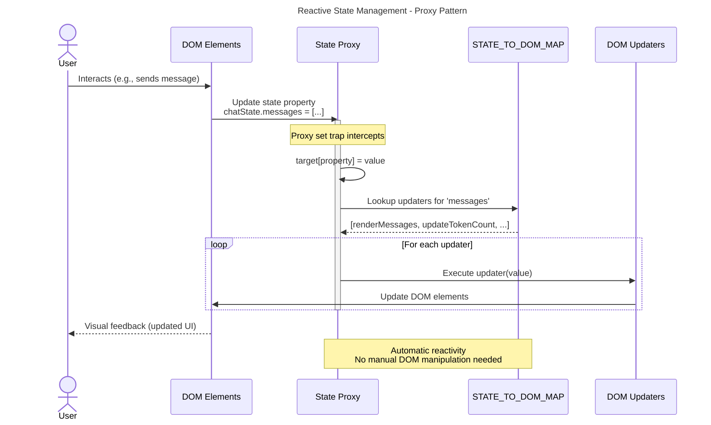

**Implementation Example:**

```javascript
// state_manager.js
const STATE_TO_DOM_MAP = {
    messages: [
        (messages) => renderMessageList(messages),
        (messages) => updateTokenCount(messages),
        (messages) => updateScrollPosition()
    ],
    isStreaming: [
        (streaming) => toggleSpinner(streaming),
        (streaming) => disableSendButton(streaming)
    ],
    activeConversationId: [
        (id) => switchConversationTab(id),
        (id) => loadConversationHistory(id)
    ]
};

const chatState = new Proxy({
    messages: [],
    isStreaming: false,
    activeConversationId: null,
    tokenCount: 0
}, {
    set(target, property, value) {
        target[property] = value;

        // Automatically trigger all registered updaters
        STATE_TO_DOM_MAP[property]?.forEach(updater => {
            try {
                updater(value);
            } catch (error) {
                console.error(`Error updating ${property}:`, error);
            }
        });

        return true;
    }
});
```

---

## Chat Interface User Flow

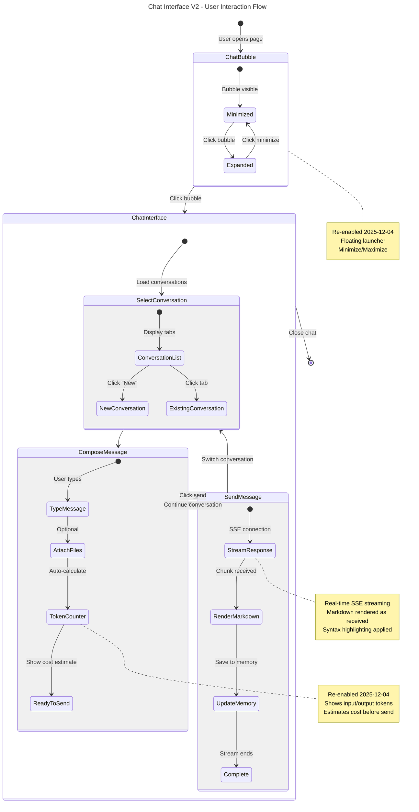

---

## Memory System Architecture

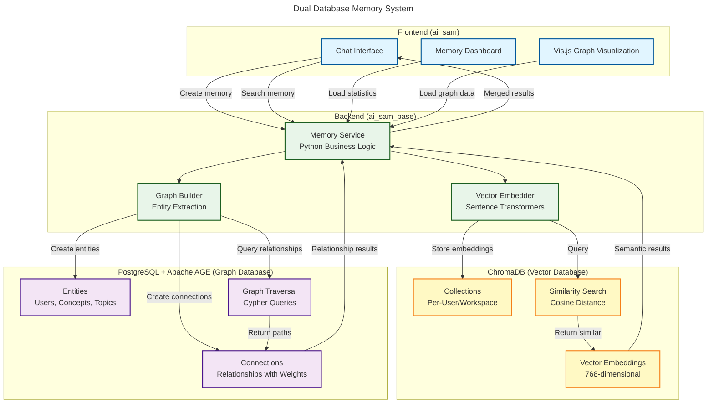

**Memory Creation Flow:**

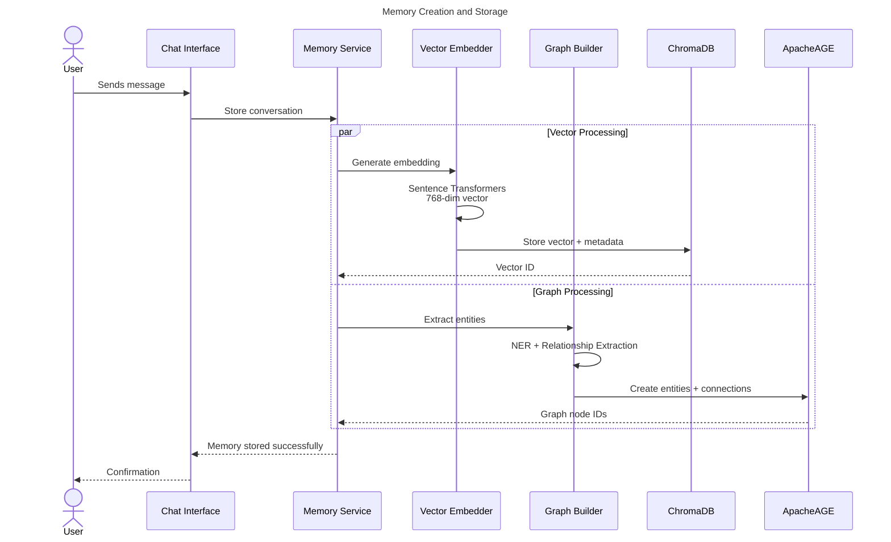

**Memory Retrieval Flow:**

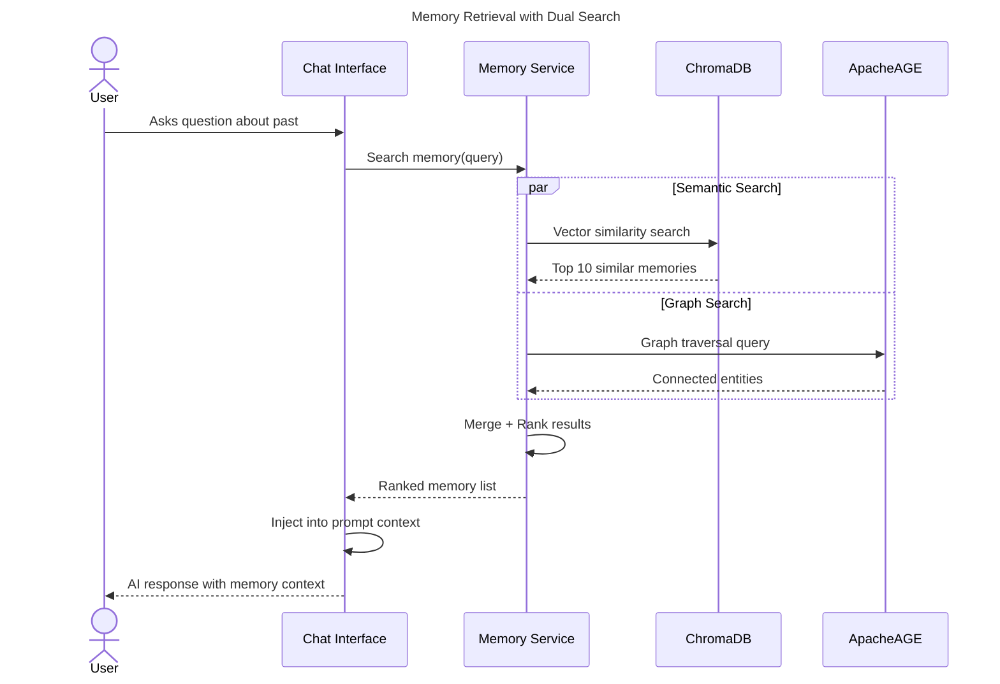

---

## Canvas Framework Architecture

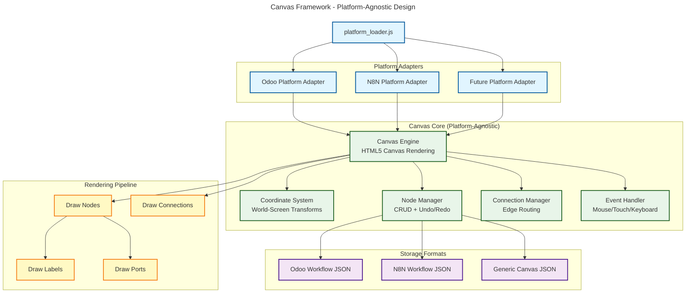

**Coordinate Transformation System:**

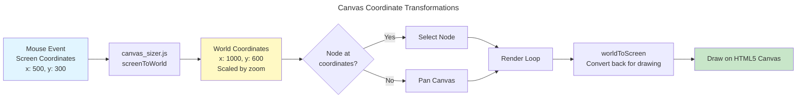

---

## API Provider Configuration (8-Tab Progressive Disclosure)

```mermaid
---
title: API Provider 8-Tab Wizard Flow
---

stateDiagram-v2
    [*] --> Tab1General: Open wizard

    state Tab1General {
        [*] --> EnterName: Name field
        EnterName --> SelectProvider: Choose from 203 vendors
        SelectProvider --> SetStatus: Active/Inactive
    }

    Tab1General --> Tab2Authentication: Next

    state Tab2Authentication {
        [*] --> SelectAuthType: API Key / OAuth / Custom
        SelectAuthType --> EnterCredentials: Encrypted storage
        EnterCredentials --> TestConnection: Validate
    }

    Tab2Authentication --> Tab3Models: Next

    state Tab3Models {
        [*] --> LoadAvailableModels: Fetch from provider
        LoadAvailableModels --> SelectModels: GPT-4, Claude, etc.
        SelectModels --> SetDefaultModel: Choose default
    }

    Tab3Models --> Tab4Endpoints: Next

    state Tab4Endpoints {
        [*] --> ConfigureBaseURL: Base API URL
        ConfigureBaseURL --> ConfigureEndpoints: Chat, Embeddings, etc.
        ConfigureEndpoints --> SetHeaders: Custom headers
    }

    Tab4Endpoints --> Tab5RateLimits: Next

    state Tab5RateLimits {
        [*] --> SetRequestLimit: Requests per period
        SetRequestLimit --> SetPeriod: Minute/Hour/Day
        SetPeriod --> SetRetry: Retry logic
    }

    Tab5RateLimits --> Tab6Cost: Next

    state Tab6Cost {
        [*] --> EnterInputCost: Cost per million input tokens
        EnterInputCost --> EnterOutputCost: Cost per million output tokens
        EnterOutputCost --> SetBudget: Optional budget alerts
    }

    Tab6Cost --> Tab7Advanced: Next

    state Tab7Advanced {
        [*] --> SetTimeout: Request timeout
        SetTimeout --> ConfigureProxy: Optional proxy
        ConfigureProxy --> CustomParams: Custom parameters
    }

    Tab7Advanced --> Tab8Testing: Next

    state Tab8Testing {
        [*] --> WriteSampleRequest: Test prompt
        WriteSampleRequest --> SendTestRequest: Execute
        SendTestRequest --> ViewResponse: Check result
        ViewResponse --> ValidationResult: Success/Failure
    }

    Tab8Testing --> Save: Save provider
    Save --> [*]: Provider configured

    note right of Tab1General
        203 vendor icons loaded from
        static/vendor_library/_registry/
    end note

    note right of Tab2Authentication
        API keys encrypted using
        Odoo's encryption system
    end note

    note right of Tab8Testing
        Live API testing before save
        Validates credentials and configuration
    end note
```

---

## MCP Server Generation Flow

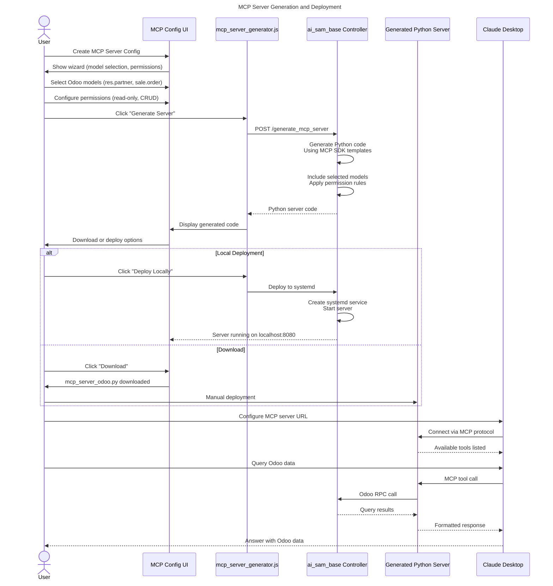

**Generated MCP Server Structure:**

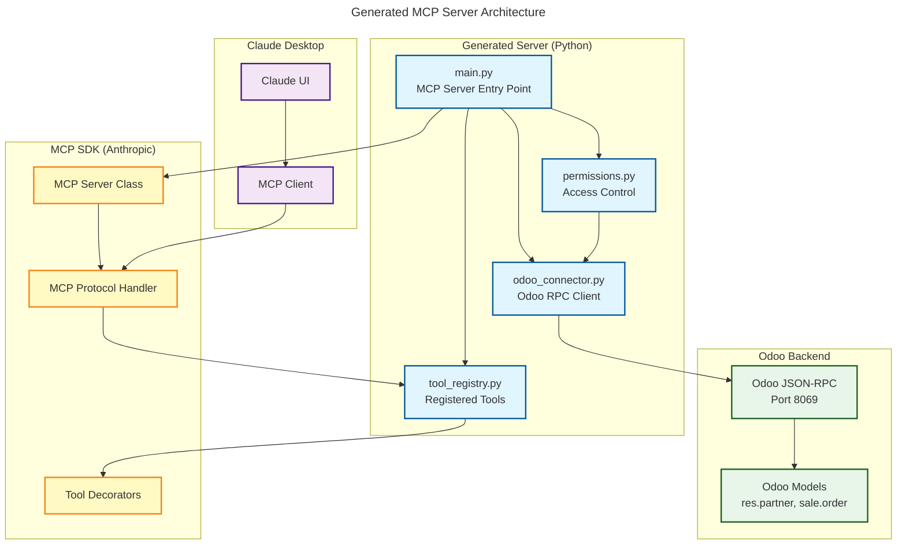

---

## Deployment Architecture

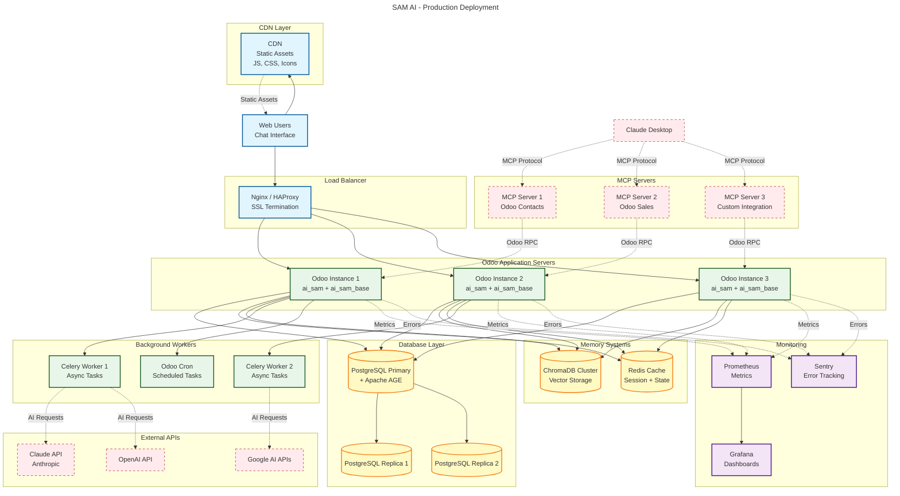

---

## File Permission System (ai.access.gate)

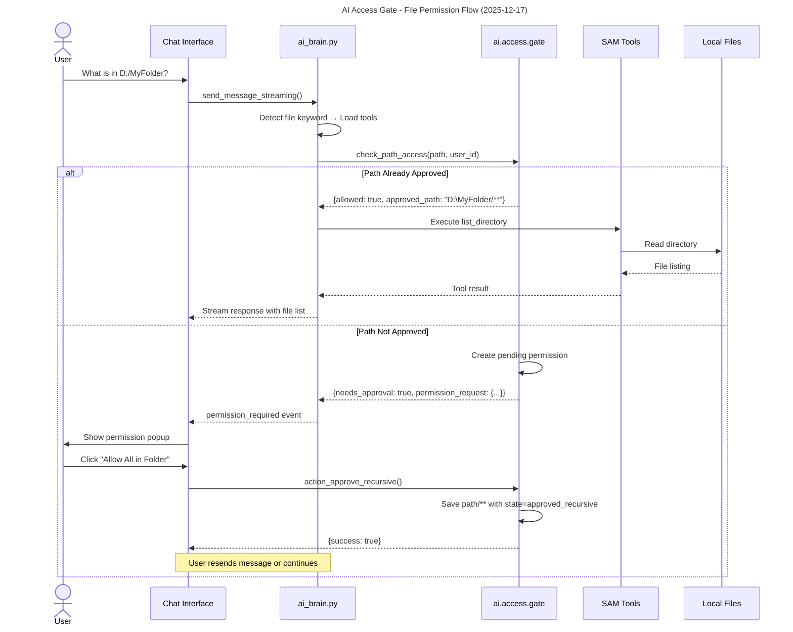

**Key Components:**

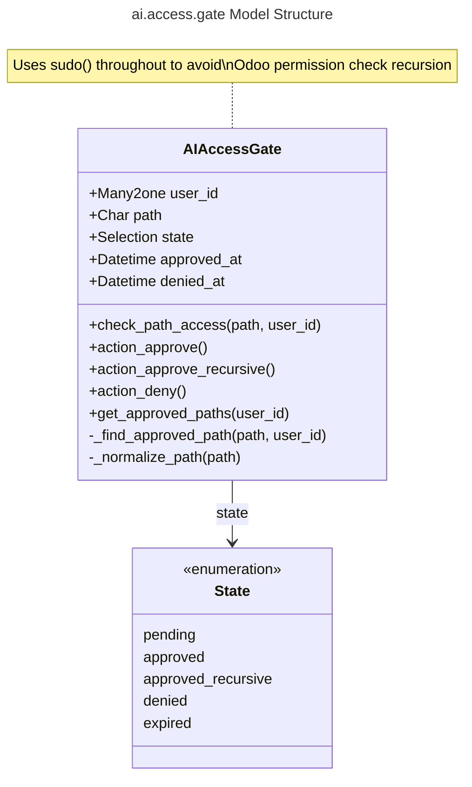

**Permission Matching Logic:**
- Exact match: `D:\MyFolder` matches `D:\MyFolder`
- Recursive match: `D:\MyFolder\sub\file.txt` matches `D:\MyFolder/**`
- Wildcard match: Uses `fnmatch` for pattern matching

---

## Agent System Architecture (2025-12-17)

```mermaid
---
title: Agent Selection and Behavior Flow
---

flowchart TB
    subgraph "Frontend (sam_chat_vanilla_v2.js)"
        AgentSelector[Agent Selector Dropdown]
        ChatInput[Chat Input]
    end

    subgraph "Controller (sam_ai_chat_controller.py)"
        GetAgent[Load agent_id from conversation]
        PassAgent[Pass agent_id to brain]
    end

    subgraph "Brain (ai_brain.py)"
        LoadAgent[Load ai.agent.registry record]
        BuildPrompt[_build_system_prompt]
        LoadTools[Load tools]
    end

    subgraph "Agent Components"
        AgentPrompt[Agent System Prompt]
        AgentKnowledge[Agent Knowledge Base]
        AgentTools[Agent Tool Config]
    end

    subgraph "Output"
        CustomBehavior[Agent-Specific AI Response]
    end

    AgentSelector -->|Select "Sales"| ChatInput
    ChatInput -->|conversation_id| GetAgent
    GetAgent -->|agent_id| PassAgent
    PassAgent -->|agent_id| LoadAgent

    LoadAgent --> BuildPrompt
    LoadAgent --> LoadTools

    BuildPrompt --> AgentPrompt
    BuildPrompt --> AgentKnowledge
    LoadTools --> AgentTools

    AgentPrompt --> CustomBehavior
    AgentKnowledge --> CustomBehavior
    AgentTools --> CustomBehavior

    classDef frontend fill:#e1f5ff,stroke:#01579b,stroke-width:2px
    classDef controller fill:#fff9c4,stroke:#f57f17,stroke-width:2px
    classDef brain fill:#e8f5e9,stroke:#1b5e20,stroke-width:2px
    classDef agent fill:#f3e5f5,stroke:#4a148c,stroke-width:2px

    class AgentSelector,ChatInput frontend
    class GetAgent,PassAgent controller
    class LoadAgent,BuildPrompt,LoadTools brain
    class AgentPrompt,AgentKnowledge,AgentTools,CustomBehavior agent
```

**Agent Registry Model:**

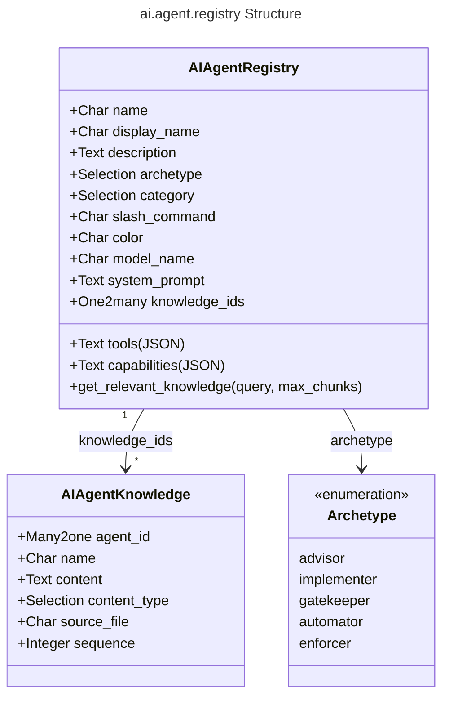

**What Changes Per Agent:**

| Component | User-Wide | Agent-Specific |
|-----------|-----------|----------------|
| File Access Permissions | ✅ Shared via ai.access.gate | |
| System Prompt | | ✅ agent.system_prompt |
| Knowledge Base | | ✅ agent.knowledge_ids |
| Tool Configuration | ✅ Base tools (read/write/list) | Future: Additional specialized tools |
| AI Model | | ✅ agent.model_name (optional) |

---

## Tool Execution Flow (2025-12-17)

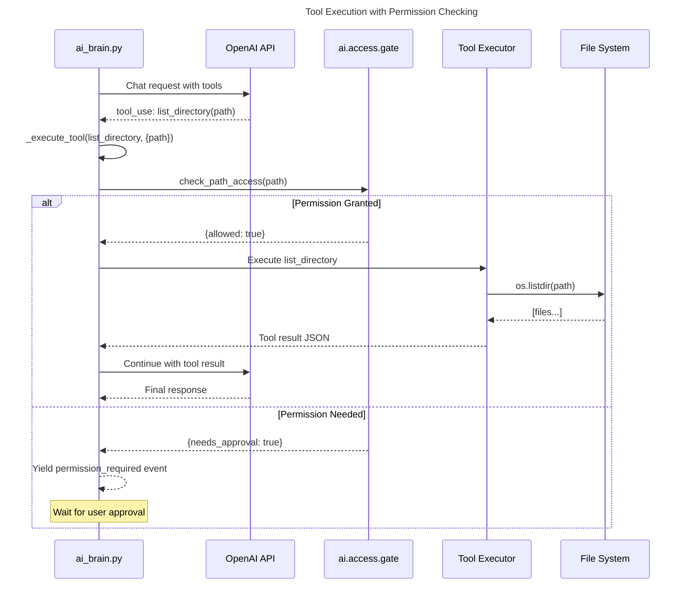

**OpenAI vs Anthropic Tool Format:**

```mermaid
---
title: Provider-Specific Tool Message Formats
---

flowchart LR
    subgraph "Anthropic Format"
        A1[role: assistant<br/>content: tool_use blocks]
        A2[role: user<br/>content: tool_result blocks]
        A1 --> A2
    end

    subgraph "OpenAI Format"
        O1[role: assistant<br/>content: null<br/>tool_calls: array]
        O2[role: tool<br/>tool_call_id: xxx<br/>content: result]
        O1 --> O2
    end

    Detect{api_format?}
    Detect -->|anthropic| A1
    Detect -->|openai| O1
```

---

## Streaming Architecture (SSE)

```mermaid
---
title: SSE Streaming with Transaction Management
---

sequenceDiagram
    participant Browser
    participant Controller as Controller
    participant Cursor as DB Cursor
    participant Brain as Brain
    participant API as AI API

    Browser->>Controller: POST /sam_ai/chat/send_streaming
    Controller->>Controller: Create SSE response

    Controller->>Cursor: with registry.cursor() as cr
    activate Cursor

    Cursor->>Brain: send_message_streaming()
    Brain->>Brain: Load profile, conversation, agent
    Brain->>Brain: Build system prompt

    Note over Brain,Cursor: CRITICAL: Commit before HTTP call
    Brain->>Cursor: env.cr.commit()

    Brain->>API: HTTP request (streaming)

    loop For each chunk
        API-->>Brain: SSE chunk
        Brain-->>Controller: yield {type: chunk}
        Controller-->>Browser: event: chunk
    end

    Brain-->>Controller: yield {type: done}
    Controller->>Cursor: cr.commit()
    deactivate Cursor
    Controller-->>Browser: event: done
```

**Key Fix (2025-12-17):** Added `self.env.cr.commit()` before making HTTP calls to prevent "idle in transaction" deadlocks where the database transaction stayed open while waiting for API responses.

---

**Last Updated:** December 17, 2025
**Module:** ai_sam (UI Layer)
**Version:** 1.0.0

**Recent Updates (2025-12-17):**
- Added ai.access.gate file permission system
- Integrated agent system (custom prompts, knowledge, tools)
- Fixed OpenAI tool format handling
- Fixed transaction deadlock in streaming

These diagrams can be rendered in:
- GitHub/GitLab (automatic Mermaid rendering)
- VS Code (Mermaid Preview extension)
- Online: https://mermaid.live
