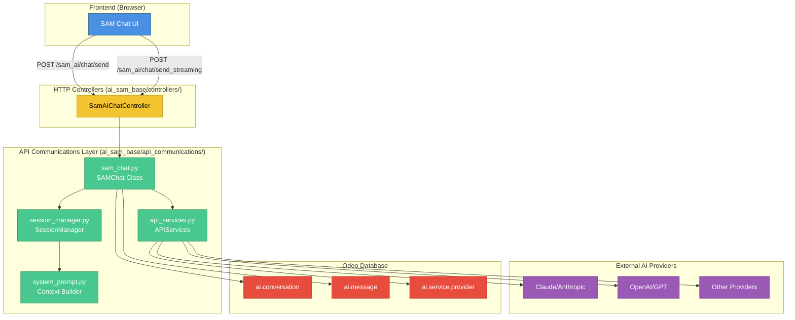
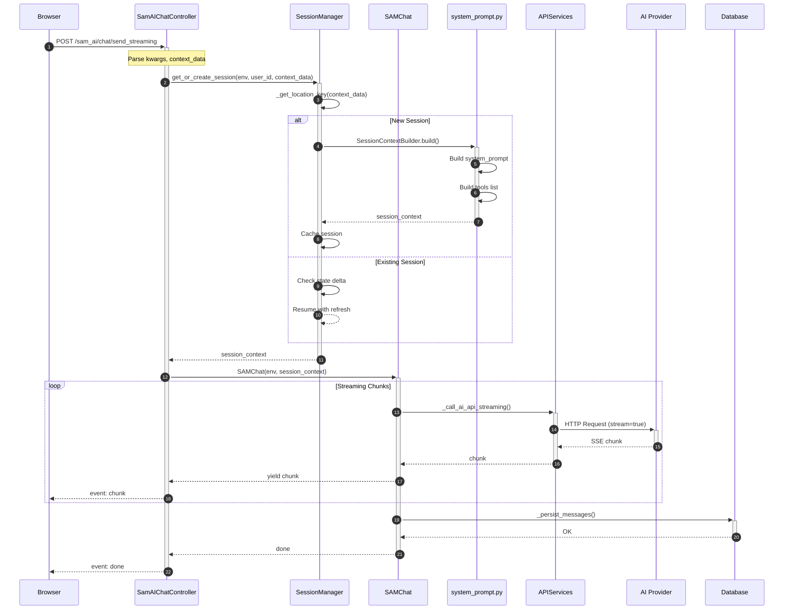
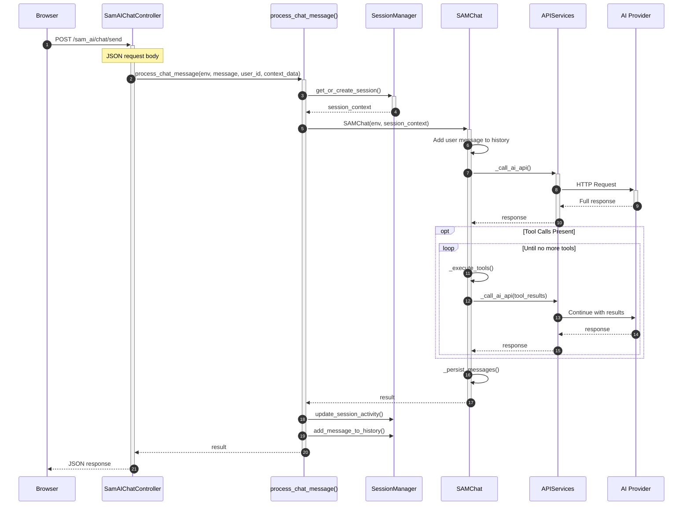
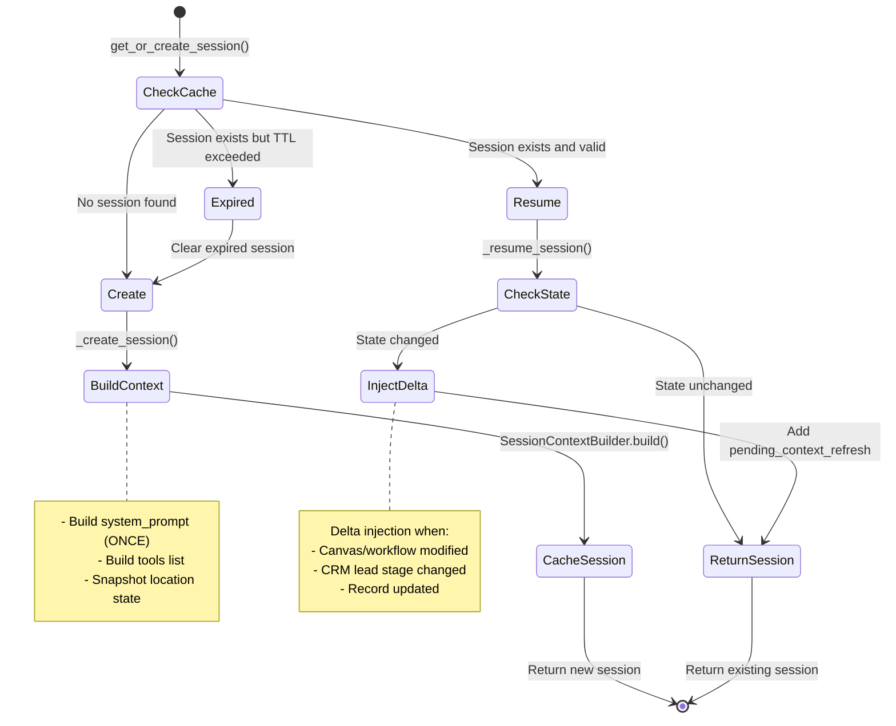
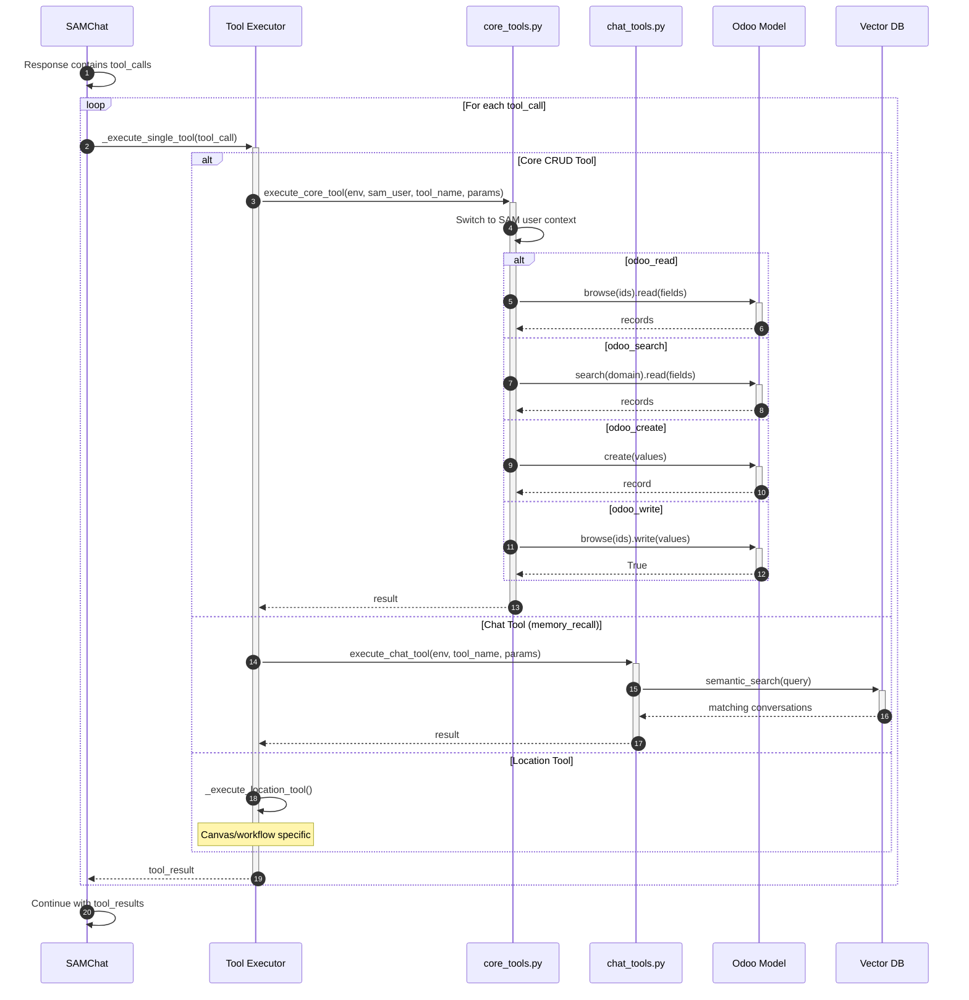
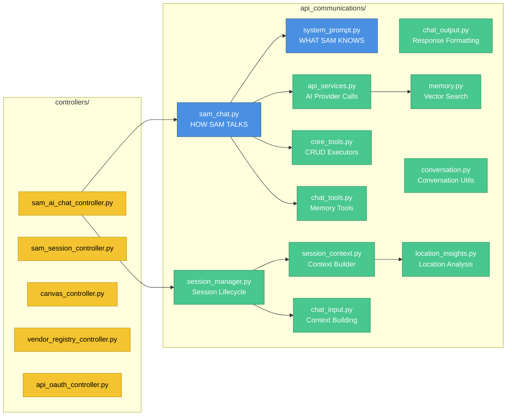

# SAM AI API Infrastructure - Data Flow Diagram

> **Scope:** Complete API infrastructure for ai_sam_base and ai_sam modules
> **Modules:** ai_sam_base, ai_sam
> **Last Updated:** 2025-01-25

---

## 1. High-Level Architecture Overview



---

## 2. Streaming Request Flow (Primary Path)



---

## 3. Non-Streaming Request Flow



---

## 4. Session Management Flow



---

## 5. API Provider Selection Flow

```mermaid
flowchart TD
    Start[APIServices.send()] --> GetFormat{Get API Format}

    GetFormat -->|config.api_format| UseConfig[Use config value]
    GetFormat -->|Not set| UseLookup[Lookup in API_FORMAT_MAP]

    UseConfig --> FormatDecision{API Format?}
    UseLookup --> FormatDecision

    FormatDecision -->|anthropic| Anthropic[_call_anthropic_api]
    FormatDecision -->|openai| OpenAI[_call_openai_api]
    FormatDecision -->|unknown| FallbackOAI[Fallback to OpenAI format]

    Anthropic --> Delegate1[Delegate to ai.service._call_claude_api]
    OpenAI --> Delegate2[Delegate to ai.service._call_openai_api]
    FallbackOAI --> Delegate2

    Delegate1 --> Response[Return Response]
    Delegate2 --> Response

    subgraph Supported["OpenAI-Compatible Providers"]
        P1[Azure OpenAI]
        P2[OpenRouter]
        P3[Together AI]
        P4[Groq]
        P5[DeepSeek]
        P6[Ollama/Local]
    end

    classDef entry fill:#4A90E2,stroke:#2C5F7F,color:#fff
    classDef decision fill:#F4C430,stroke:#B8941E,color:#000
    classDef anthropic fill:#D946EF,stroke:#A855F7,color:#fff
    classDef openai fill:#48C78E,stroke:#2E8B57,color:#fff

    class Start entry
    class GetFormat,FormatDecision decision
    class Anthropic,Delegate1 anthropic
    class OpenAI,Delegate2,FallbackOAI openai
```

---

## 6. Tool Execution Flow



---

## 7. File-to-Component Mapping



---

## Quick Summary

1. **Entry:** HTTP requests arrive at `SamAIChatController` via `/sam_ai/chat/send` or `/sam_ai/chat/send_streaming`
2. **Session:** `SessionManager` handles session lifecycle with Resume + Refresh pattern
3. **Processing:** `SAMChat` orchestrates message processing, tool execution, and persistence
4. **AI Calls:** `APIServices` routes to appropriate AI provider (Claude, OpenAI, etc.)
5. **Output:** Streaming (SSE events) or JSON response back to frontend

---

## Related Documentation

- [ai_sam_base Module](../../04_modules/ai_sam_base/) - Core SAM AI module
- [ai_sam Module](../../04_modules/ai_sam/) - SAM UI/UX module
- [API Communications Architecture](../api_communications/) - V2 architecture details
- [Detailed Walkthrough](./sam_ai_api_infrastructure_DETAIL.md) - Step-by-step explanation
