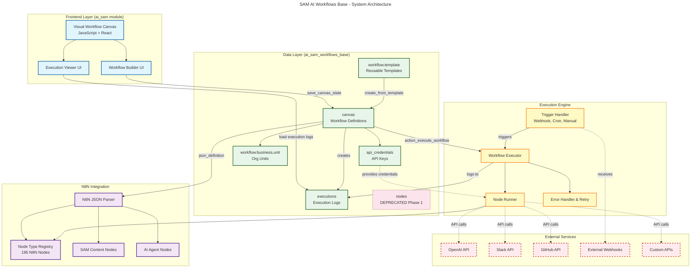
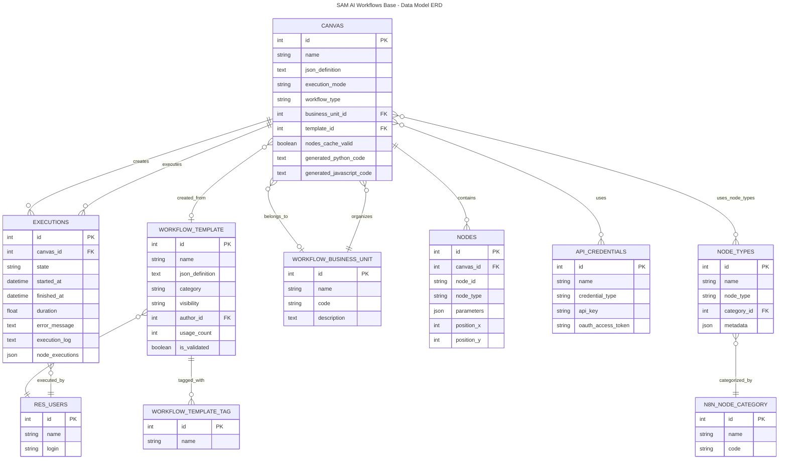
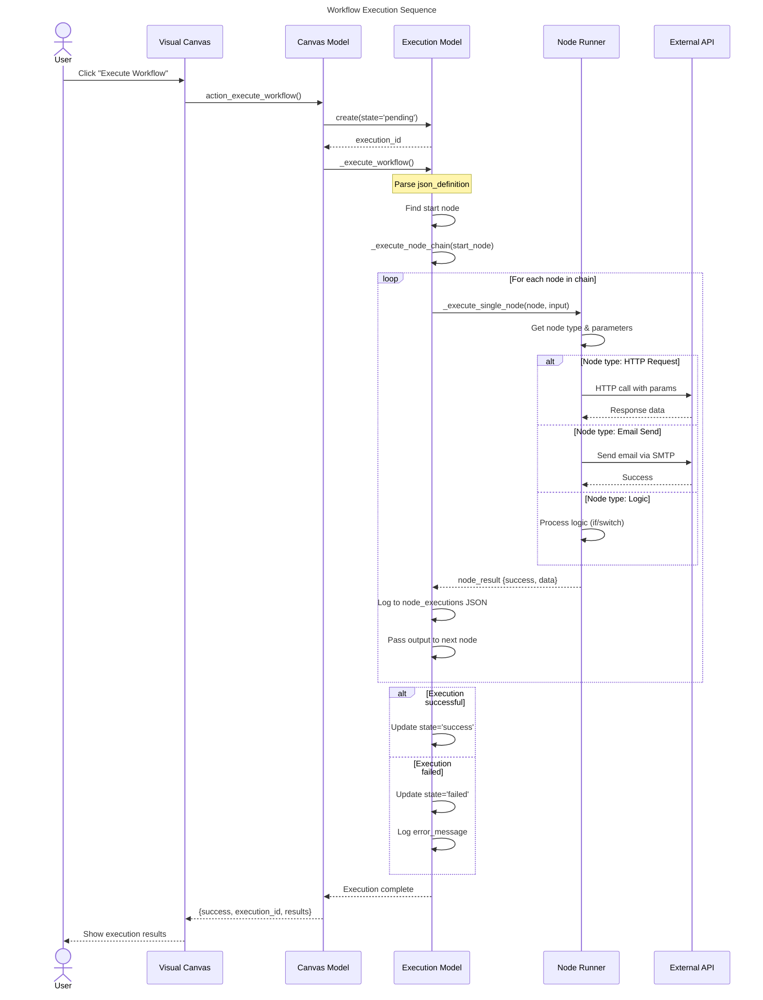
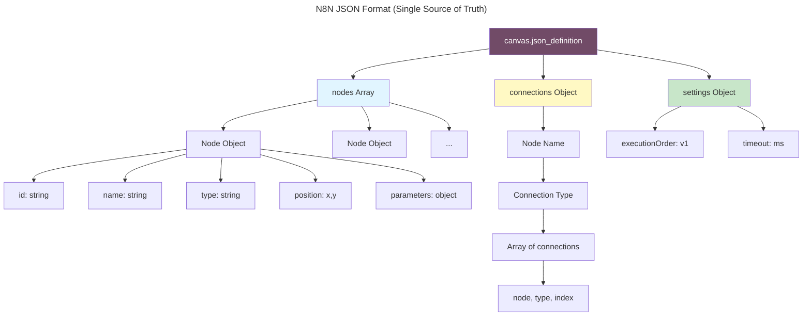
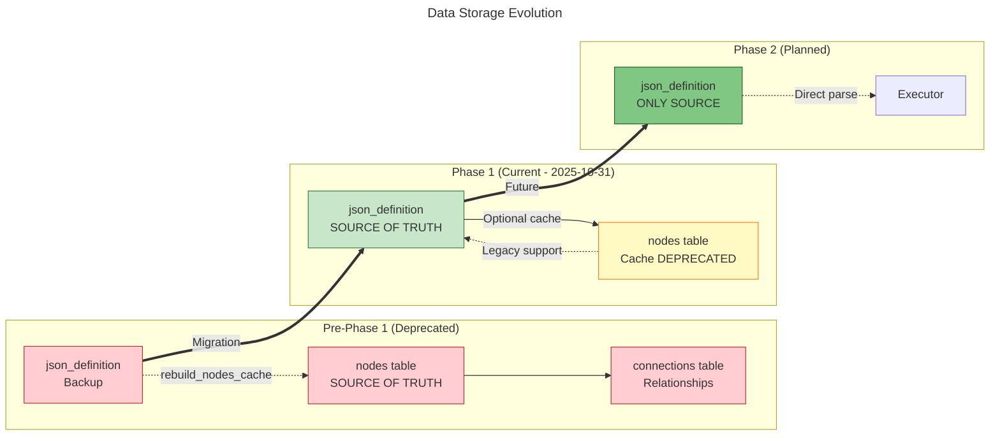
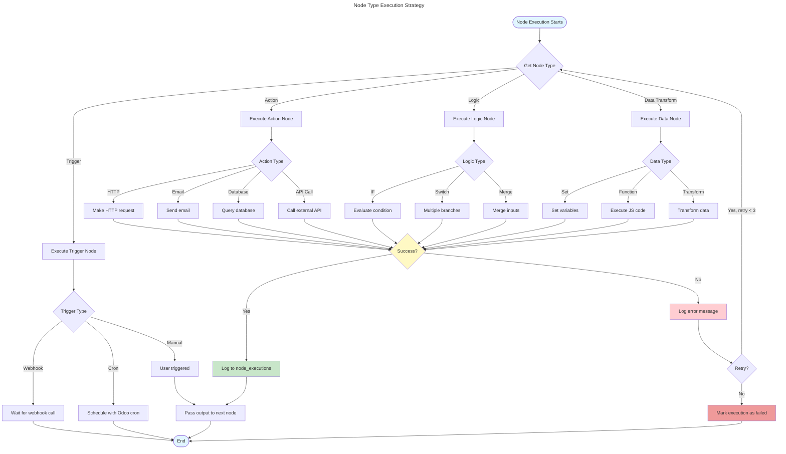
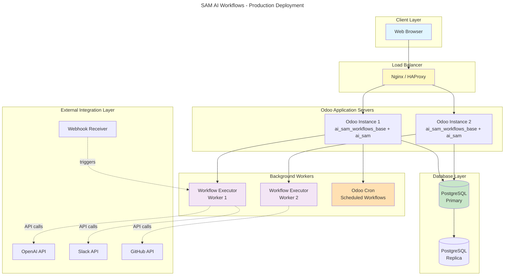

# Architecture

**Original file:** `ARCHITECTURE.mermaid`
**Type:** MERMAID

---



---

## Data Model Relationships



---

## Workflow Execution Flow



---

## Template Creation and Usage Flow

```mermaid
---
title: Workflow Template Lifecycle
---

stateDiagram-v2
    [*] --> CreateWorkflow: User creates workflow

    state CreateWorkflow {
        [*] --> BuildCanvas: Add nodes
        BuildCanvas --> ConnectNodes: Connect nodes
        ConnectNodes --> TestWorkflow: Test execution
        TestWorkflow --> RefineWorkflow: Fix errors
        RefineWorkflow --> BuildCanvas: Iterate
    }

    CreateWorkflow --> SaveAsTemplate: User saves as template

    state SaveAsTemplate {
        [*] --> FillMetadata: Name, description, category
        FillMetadata --> AddDocumentation: Add usage docs
        AddDocumentation --> SetVisibility: Private/Team/Public/Marketplace
    }

    SaveAsTemplate --> TemplateCreated: Template saved

    state TemplateCreated {
        [*] --> Validation
        Validation --> Validated: action_validate_template()
    }

    TemplateCreated --> BrowseMarketplace: Others browse templates

    state BrowseMarketplace {
        [*] --> SearchTemplates: Filter by category/tags
        SearchTemplates --> PreviewTemplate: action_preview_template()
        PreviewTemplate --> SelectTemplate: User selects
    }

    BrowseMarketplace --> CreateFromTemplate: action_create_workflow()

    CreateFromTemplate --> CustomizeWorkflow: User customizes
    CustomizeWorkflow --> SaveWorkflow: Workflow saved
    SaveWorkflow --> IncrementUsageCount: template.usage_count++

    IncrementUsageCount --> [*]

    style CreateWorkflow fill:#e1f5ff
    style SaveAsTemplate fill:#fff9c4
    style TemplateCreated fill:#c8e6c9
    style BrowseMarketplace fill:#f3e5f5
```



---

## N8N JSON Structure



---

## Flatline Migration - Phase 1 vs Phase 2



---

## Node Execution Types



---

## Deployment Architecture



---

**Note:** These diagrams are written in Mermaid syntax and can be rendered in:
- GitHub (automatic rendering in .md files)
- GitLab (automatic rendering)
- VS Code (with Mermaid Preview extension)
- Online: https://mermaid.live

**Last Updated:** December 10, 2025

```
